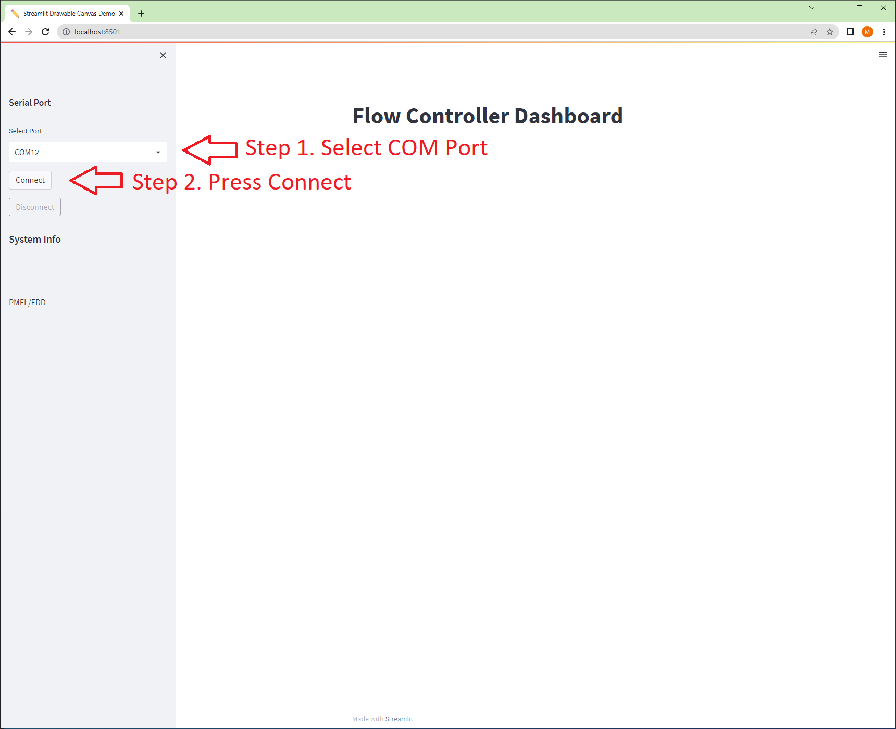
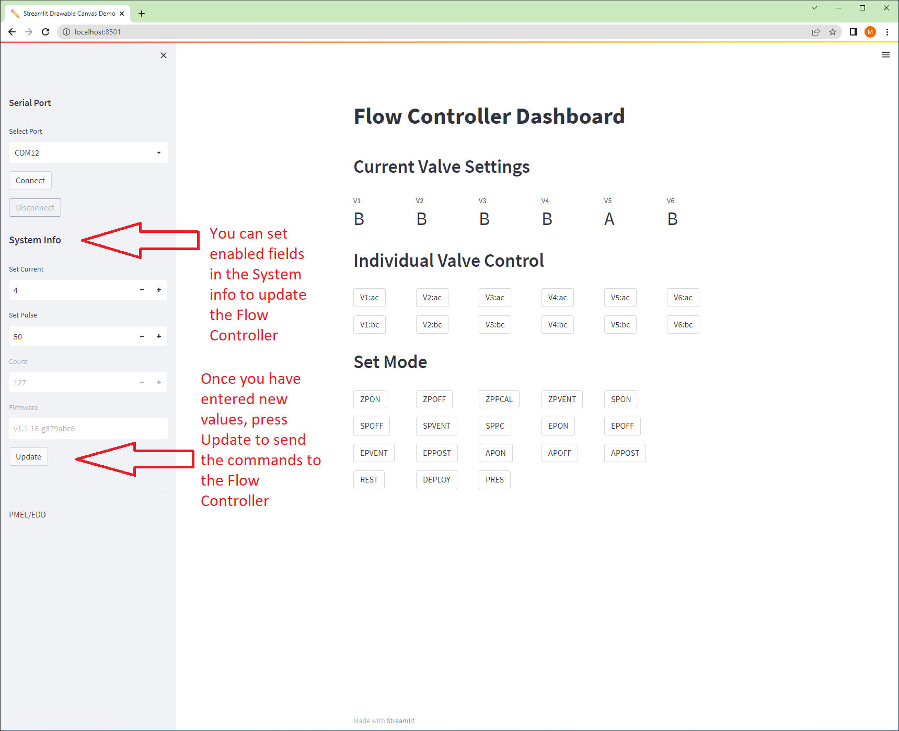
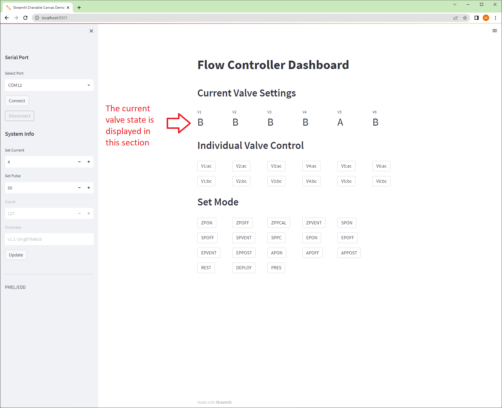
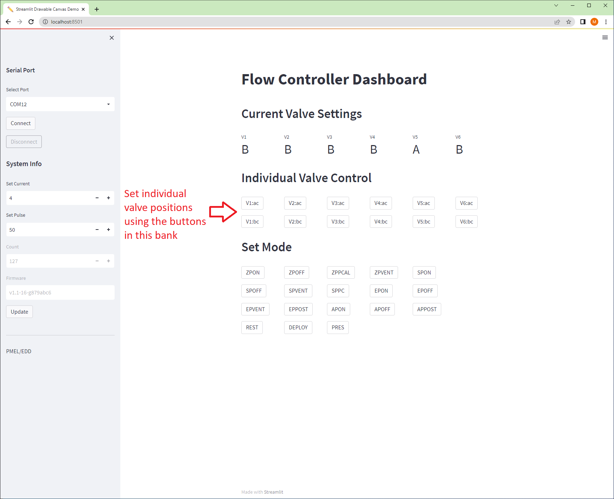
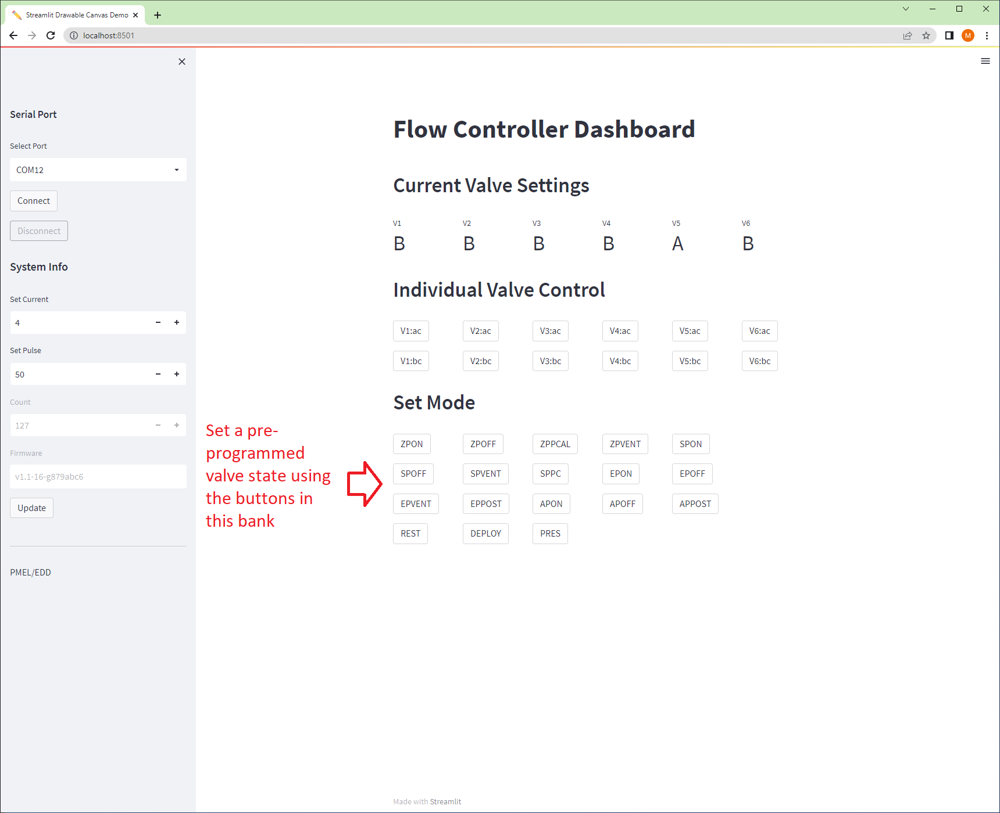

# Flow Controller User Interface
## Overview
This document contains operational information for the Flow Controller Graphic User Interface, Command Line Interface and direct communication with the Flow Controller over RS-232

----------------------------------------------------------------
## Python Installation Instructions
The CLI and the GUI require Python 3.9 or later to be installed, as well as a virtual environment to run in.  
### Creating a virtual environment and installing required packages
1. Install Python 3.9 or later if not already installed
2. Open a terminal (In windows you can use CMD or PowerShell)
3. Navigate to this README directory (path/EDD-FlowController/Software/FlowControllerUI/)
4. run the following commands
    ```cmd
    > python -m venv .venv
    For Windows
    > .venv\Scripts\activate
    for Linux
    > source .venv/bin/activate
    
    > python -m pip install -r requirements.txt
    ```
5. Wait for the packages to be installed and then the GUI and CLI will be ready to run


----------------------------------------------------------------
## Direct Communication with Flow Controller (RS-232)
The Flow Controller uses a simple RS-232 interface to communicate with the host (ASVCO2, user, etc.).  


### RS-232 Settings
* Baudrate: 9600
* Bits: 8
* Flow Contro: None
* Stop Bits: 1

### RS-232 Commands
* All commands are terminated with "\r\n"
* All commands respond with ACK (0x06) if valid or NACK (0x15) if invalid
  * This response will be referred to as *\<A/N\>* in the following table
* All command respond with current 6 valve and 1 pump settings
    *  (ABABAB1 would be V1=ac, V2=bc, V3=ac, V4=bc, V5=ac, V6=bc, Pump=ON))
    *  This Response will be referred to as *\<VALVE\>* in the following table


| Command | Response | Description |
| --- | --- | --- |
| mode | *\<A/N\>* **MODE: XXX**\r\n *\<VALVE\\>* | Get the current mode |
| mode=SSSSS | *\<A/N\>* *\<VALVE\>* | Set the Mode to SSSSSS *See modes below | 
| vac=X | *\<A/N\>* *\<VALVE\>* | Set Valve X to position AC |
| vbc=X | *\<A/N\>* *\<VALVE\>* | Set Valve X to position BC |
| current | *\<A/N\>* **CURRENT: X**\r\n *\<VALVE\>* | Read Current Setting (1 - 7) |
| current=X | *\<A/N\>* *\<VALVE\>* | Set the Current Setting to X (integer)|
| pulse | *\<A/N\>* **PULSE: XXX**\r\n *\<VALVE\>*  | Read the Pulse Length in milliseconds (10-100) |
| pulse=XXX | *\<A/N\>* *\<VALVE\>* | Set the pulse length in milliseconds (integer 10 - 100) |
| ver | *\<A/N\>* **VERSION: vMM.mm-bb-hhhhhhhh**\r\n *\<VALVE\>* | Firmware Version |
| count | *\<A/N\>* **COUNT: XXX**\r\n *\<VALVE\>* | Read the Count (number or power cycles) |


| Mode Command | Description |
|---|---|
| ZPON | Zero, Pump ON |
| ZPOFF | Zero, Pump OFF |
| ZPPCAL | Zero, Post Cal |
| ZPVENT | Zero, Vent |
| SPON | Span, Pump ON |
| SPOFF | Span, Pump OFF |
| SPVENT | Span, Vent |
| SPPC | Span, Post Cal |
| EPON | Equilibrate, Pump ON |
| EPOFF | Equilibrate, Pump OFF |
| EPVENT | Equilibrate, Vent |
| EPPOST | Equilibrate, Post run |
| APON | Air, Pump ON |
| APOFF | Air, Pump OFF |
| APPOST | Air, Post run
| REST | Rest mode |
| DEPLOY | Deploy mode |
| PRES | Pressurize mode |
| PURGE | Purge mode |
| CLEAR | Clear mode |

----------------------------------------------------------------
## Command Line Interface (CLI)
Within this director is a python-based command line interface to interact with the Flow Controller
without needing to send direct commands over the RS-232 port.  

### Requirements
Follow the preceding Python Installation Instructions before running the CLI

### CLI Usage
Note: At any time within the terminal, you can use the tag ```--help``` to see a description of the commands

To initialize the CLI for the correct serial port, use the following instructions.  Once run, a .env file is 
generated and you will not need to run this command unless the serial port changes.
1. Open a terminal to the path specified in the Python Installation Instructions above
2. Find the serial port your Flow Controller is attached to and run the following command:
    * ```> python cli.py setup <PORT>```
    * ```<PORT>``` is the port number (COM12, /dev/ttyUSB0, etc.)

#### CLI Commands
To use the CLI, run the command ```> python cli.py COMMAND ARGS``` 

| Command (CMD) | Arguments (ARGS) | Description | Returns |
|--- | --- | --- | --- |
| info | (None) | Retreive information from the Flow Controller | ```FW Version: vX.Y-Z-hhhhhhhh``` <br> ```Pulse: XX``` <br> ```Current: X``` <br>```Count: XXX``` <br> ```Mode: XXXXXX``` |
| mode | None or \<Mode Command\> | If no argument, returns current mode setting.  If Mode Command sent, sets to specified mode and returns mode setting | ```Mode: XXXXXX``` |
| state | None | Retrieve the current valve state | ```Current State: VVVVVV``` |
| valve | Valve # (1-6), Direction (a or b) | Sets the specified valve to specified direction |  ```Current State: VVVVVV``` |
| valves | VVVVVV where V is A or B for valve position | Sets all the valves to the value requested | ```Current State: VVVVVV``` |


### Example Commands

| Command | Description |
| --- | --- |
| ```python cli.py mode EPON``` | Set the Flow Controller mode to Equilibrate, Pump ON |
| ```python cli.py valve 3 b``` | Set Valve 3 to position *bc* |
| ```python cli.py valves AAABBB``` | Set valves to ***V1=AC***, ***V2=AC***, ***V3=AC***, ***V4=BC***, ***V5=BC***,***V6=BC*** |
| ```python cli.py info``` | Returns the system information |
| ```python cli.py state``` | Returns the valve states |


----------------------------------------------------------------
## Graphic User Interface
The graphic user interface is designed to be the most intuitive interface for users not 
familiar with command line interfaces or direct RS-232 control.  

1. Open a terminal to the path specified in the Python Installation Instructions above
2. Run the following command:<br>
    ```> streamlit run .\gui.py```
3. Wait for the web page to load.

#### Connect to Device
* In the sidebar, select the serial port attached to the Flow Control board and press "Connect"



### GUI Control
#### Updating System Information
* System Information can be changed using the fields in the sidebar.  Press "Update" when you want the changes to be saved to the device.


#### Current Valve Positions
* The current valve state is shown in the "Current Valve Settings" section.  It is auto-updated after any control command is selected.


#### Set Individual Valve Position 
* To set individual valves, use the buttons in the "Individual Valve ControL" Section.  Vx:ac sets Valve "x" to 'ac' position, while Vx:bc sets valve "x" to 'bc' position.


#### Set Valves to Pre-programmed Mode
* To set the valves to the pre-programmed ASVCO2 positions, use the buttons in the "Set Mode" section.

