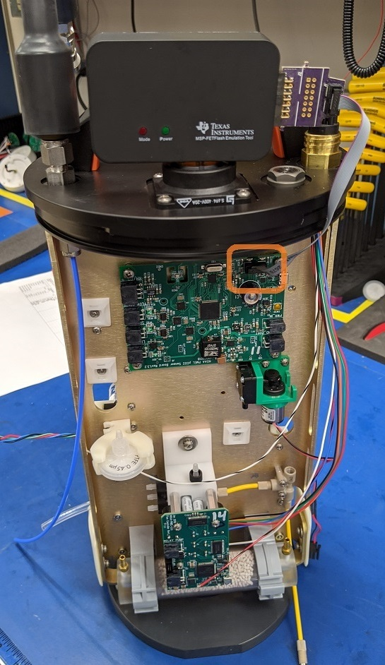
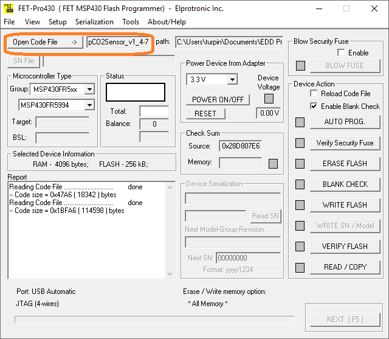
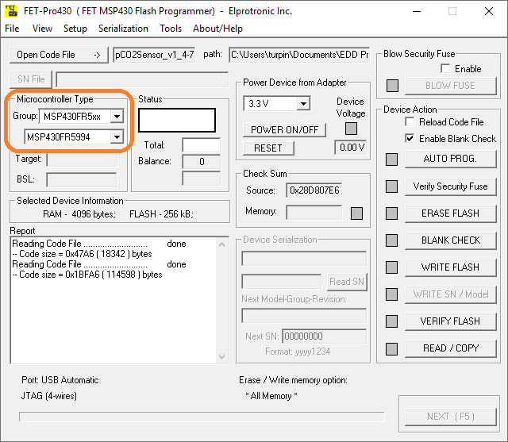

# MSP430 Programming Instructions

PMEL's Engineering Development Division uses MSP430 microcontrollers in many of
the custom circuits.  The following is the procedure for programming the
microcontrollers, also known as "flashing".

## Requirements
The following are the basic hardware and software requirements for loading
binary files onto the microcontroller.

### Hardware
* Texas Instruments MSP-FET Flash Emulation Tool
* EDD Custom 0.100" Pitch x14-pin to 0.050" pitch x10-pin converter

### Software
* Elprotronic, Inc. FET-Pro-430-LITE
  * Free download from www.elprotronic.com

### Files
* Pre-generated binary files for target device
  * File should have the form "DeviceName_version.txt

## Loading "Binary" files to target
  1. Connect the programming cable to the microcontroller and the MSP-FET.
  

  1. Apply Power to the target board

  1. Open the FET-Pro-430 program

  1. Press the button "Open Code File ->", navigate to the location of the "binary"
  file (ProjectName.txt)
  

  1. In the Microcontroller Type block (refer to User Manual for values)
    * In "Group", select the general type of MSP430 used.
    * On the next line, select the specific type of MSP430 used
  

  1. In the "Device Action" block, press "AUTO PROG."
    * If successfull, the "Status" block should show **"Pass"**
    * If unsuccessfull, press "ERASE FLASH" and try step 6 again.
  

  1. The device is now programmed. Pressing the reset switch or power cycling the instrument will allow console communication.

  **NOTE:** The board may require additional configuration settings over the
    console.  Consult the User Manual for the corresponding device.

## Reloading System Parameters
  
### Serial Number
  1. The ASVCO2 Gen 2 System number needs to be re-entered with this command: "serial= xxxx\r\n" (Note: This number can be found on the ASVCO2 label on the system's endcap)
  
### RTC Calibration
  1. From the ASVCO2 Command Prompt send command "rtccal\r\n" 

  1. From Page 5 of the ASVCO2 Gen 2 Build Checklist, enter the value from step 3.19.2 
  
  1. If the buildlist is not available, use a frequency counter to measure the frequency output on the RTC header JB6. Input the value from the counter to two decimal places (Example: "32768.00\r\n").
  
### SPAN Gas Concentration
  1. The span gas concentration needs to be re-entered with command "span= xxx.yy\r\n"  (note the space between "=" and the value). 
  
  1. The second span concentration needs to updated only if a span2 calibration is required. Typically this is not required for normal operation.